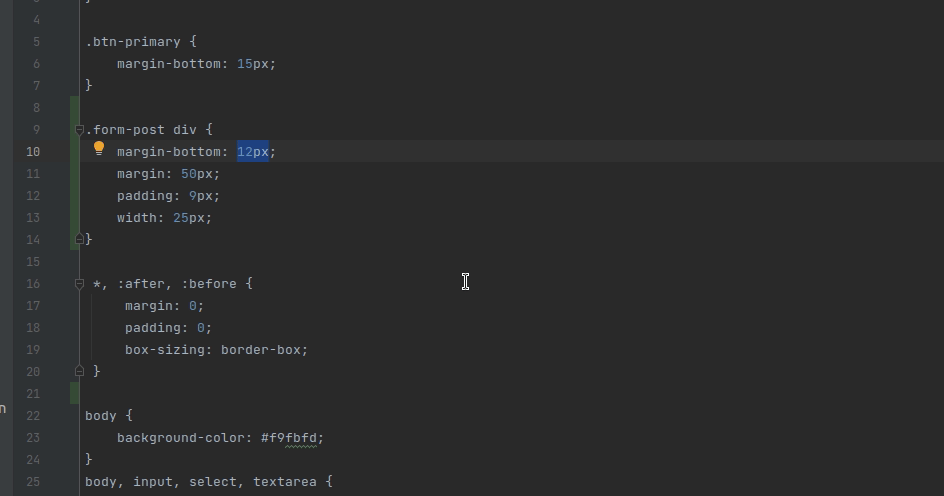
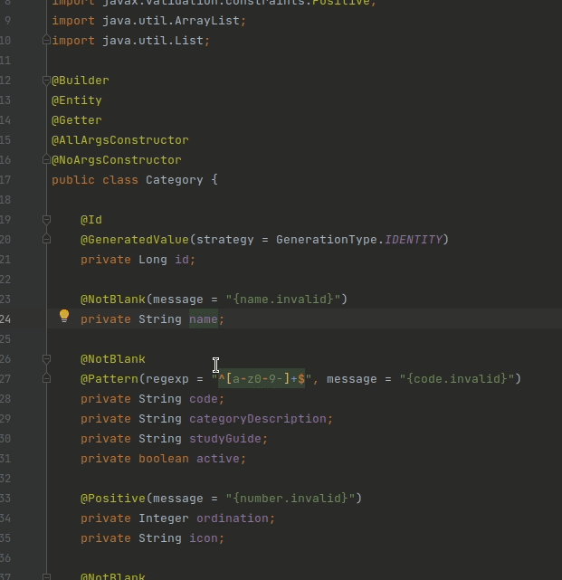

# ThirdHand

Plugin for intelliJ that will make the frontend development a bit handy,
it works by making an automatic conversion from px to rem & px to em
U can also choose the base value, that you be used for the conversion.

### How to use it
First of all you must choose the base value to make the conversion by pressing `ctrl + alt + Q`
Then in your css page base selecting the text that you want to convert just press `ctrl + alt + E` to convert
to EM, or `ctrl + alt + R` to convert is to REM.

### Google it
There's another funcionality that sometimes can save us some time, by select any text or phrase 
in the project and press `ctrl + alt + G` you can google it easier.

coming soon on the marketplace!